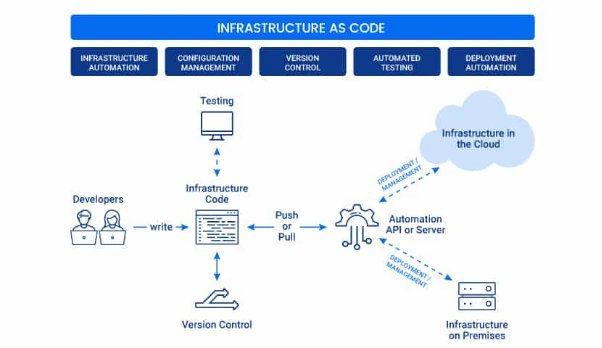
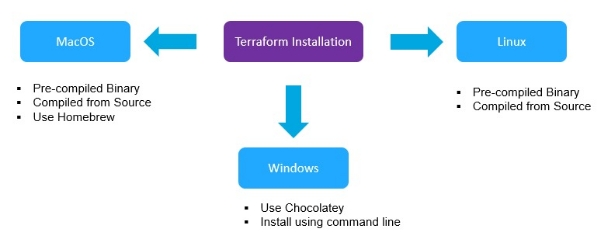

## <a name="_fs4nsrsitez1"></a>**What Is Infrastructure as Code (IaC)?**
**Infrastructure as a Code (IaC)** is a widespread terminology among DevOps professionals and a key DevOps practice in the industry. It is the process of managing and provisioning the complete IT infrastructure (comprising both physical and virtual machines) using machine-readable definition files. It helps in automating the complete data center by using programming scripts.


### <a name="_60sn34m5fysn"></a>**Popular IaC Tools:**
**1. Terraform** An open-source declarative tool that offers pre-written modules to build and manage an infrastructure.
**2. Chef:** A configuration management tool that uses cookbooks and recipes to deploy the desired environment. Best used for Deploying and configuring applications using a pull-based approach.
**3. Puppet:** Popular tool for configuration management that follows a Client-Server Model. The puppet needs agents to be deployed on the target machines before the puppet can start managing them.
**4. Ansible:** Ansible is used for building infrastructure as well as deploying and configuring applications on top of them. Best used for Ad hoc analysis.
**5. Packer:** Unique tool that generates VM images (not running VMs) based on steps you provide. Best used for Baking compute images.
s**6. Vagrant:** Builds VMs using a workflow. Best used for Creating pre-configured developer VMs within VirtualBox.
## <a name="_vvjppewdlm39"></a>**What Is Terraform?**
**Terraform** is one of the most popular **Infrastructure-as-code (IaC) tool**, used by DevOps teams to automate infrastructure tasks. It is used to automate the provisioning of your cloud resources. Terraform is an open-source, cloud-agnostic provisioning tool developed by HashiCorp and written in GO language.


**Benefits of using Terraform:**

- Does orchestration, not just configuration management
- Supports multiple providers such as AWS, Azure, Oracle, GCP, and many more
- Provide immutable infrastructure where configuration changes smoothly
- Uses easy-to-understand language, HCL (HashiCorp configuration language)
- Easily portable to any other provider
- Free to use.
## <a name="_d7pju3rduutk"></a>**Terraform Lifecycle**
Terraform lifecycle consists of – **init**, **plan**, **apply**, and **destroy**.


1\. **Terraform init** initializes the (local) Terraform environment. Usually executed only once per session.
2\. **Terraform plan** compares the Terraform state with the as-is state in the cloud, builds and displays an
execution plan. This does not change the deployment (read-only).
3\. **Terraform apply** executes the plan. This potentially changes the deployment.
4\. **Terraform destroy** deletes all resources that are governed by this specific terraform environment.
## <a name="_dkm4se9dz9no"></a>**Terraform Core Concepts**
**1. Variables**: Terraform has input and output variables, it is a key-value pair. Input variables are used as parameters to input values at run time to customize our deployments. Output variables are return values of a terraform module that can be used by other configurations.
Read our blog on **Terraform Variables**

**2. Provider**: Terraform users provision their infrastructure on the major cloud providers such as AWS, Azure, OCI, and others. A *provider* is a plugin that interacts with the various APIs required to create, update, and delete various resources.
Read our blog to know more about **Terraform Providers**

**3. Module**: Any set of Terraform configuration files in a folder is a *module*. Every Terraform configuration has at least one module, known as its ***root module.***

**4. State**: Terraform records information about what infrastructure is created in a Terraform *state* file. With the state file, Terraform is able to find the resources it created previously, supposed to manage and update them accordingly.

**5. Resources**: Cloud Providers provide various services in their offerings, they are referenced as Resources in Terraform. Terraform resources can be anything from compute instances, virtual networks to higher-level components such as DNS records. Each resource has its own attributes to define that resource.

**6. Data Source**: Data source performs a read-only operation. It allows data to be fetched or computed from resources/entities that are not defined or managed by Terraform or the current Terraform configuration.

**7. Plan**: It is one of the stages in the Terraform lifecycle where it determines what needs to be created, updated, or destroyed to move from the real/current state of the infrastructure to the desired state.

**8. Apply**: It is one of the stages in the Terraform lifecycle where it applies the changes real/current state of the infrastructure in order to achieve the desired state.
##
## <a name="_ccwurlp04any"></a><a name="_9cspn6bcp3xs"></a>**Terraform Installation**
Before you start working, make sure you have Terraform installed on your machine, it can be installed on any OS, say Windows, macOS, Linux, or others. Terraform installation is an easy process and can be done in a few minutes.
### <a name="_33nr244qzapi"></a>**Windows**
1. Download the Windows binary for 32 or 64-bit CPUs from <https://www.terraform.io/downloads>.
1. Unzip the package.
1. Move the Terraform binary to the Windows PATH.
### <a name="_ywjup5mlb03v"></a>**Linux (Ubuntu) Package Manager**
1. Run the following commands at the terminal.
```shell
wget -O- https://apt.releases.hashicorp.com/gpg | sudo gpg --dearmor -o /usr/share/keyrings/hashicorp-archive-keyring.gpg
echo "deb [signed-by=/usr/share/keyrings/hashicorp-archive-keyring.gpg] https://apt.releases.hashicorp.com $(lsb_release -cs) main" | sudo tee /etc/apt/sources.list.d/hashicorp.list
```

2. Install Terraform using the package manager.

```shell
sudo apt update && sudo apt install terraform -y
```

##
## <a name="_36hhprgbizxv"></a><a name="_cmhv1ctks9f2"></a>**Terraform Providers**
A provider is responsible for understanding API interactions and exposing resources. It is an executable plug-in that contains the code necessary to interact with the API of the service. Terraform configurations must declare which providers they require so that Terraform can install and use them.


Terraform has over a hundred providers for different technologies, and each provider then gives Terraform user access to its resources. So through AWS provider, for example, you have access to hundreds of AWS resources like EC2 instances, AWS users, etc.

```shell

terraform {
 required_providers {
   aws = {                      # provider local name
     source  = "hashicorp/aws"  # global and unique source address
     version = "~> 3.0"         # version constraint
   } 
 }
}

# Configure the AWS Provider
provider "aws" {
 region = "us-central-1" # provider configuration options
}

```
##
## <a name="_1qq774us7foi"></a><a name="_h626tcl7denx"></a>**Dependency Lock File**

Terraform dependency lock file allows us to lock to a specific version of the provider.

If a particular provider already has a selection recorded in the lock file, Terraform will always re-select that version for installation, even if a newer version has become available.

You can override that behavior by adding the -upgrade option when you run terraform init,


## <a name="_eip9h2ioe7uz"></a>**Terraform Refresh**

Terraform can create an infrastructure based on configuration you specified.

It can happen that the infrastructure gets modified manually.


**Challenge**

The terraform refresh command will check the latest state of your infrastructure

and update the state file accordingly.


You shouldn't typically need to use this command, because Terraform

automatically performs the same refreshing actions as a part of creating a plan

in both the terraform plan and terraform apply commands.

**Usage**

The terraform refresh command is deprecated in newer version of terraform.

The -refresh-only option for terraform plan and terraform apply was introduced in

Terraform v0.15.4.


## <a name="_ywiqzmn5fyng"></a>**Terraform Resources**
Resources are the most important element in the Terraform language. It describes one or more infrastructure objects to manage. Together the resource type and local name serve as an identifier for a given resource and must be unique within a module. Example: aws\_vpc.main

Creating resources:

```shell

resource "<provider>_<resource_type>" "local_name"{
    argument1 = value
    argument2  = value
    ...
}

# Example:
resource "aws_vpc" "main" {
    cidr_block = "10.0.0.0/16"
    enable_dns_support = true

    tags = {
        "Name" = "Main VPC"
    }
}

```

##
## <a name="_1rd7q37dsvc3"></a><a name="_7ta75monbr0f"></a>**Terraform State Files**
Terraform stores the state of the infrastructure that are created in the .tf files in the Terraform State File.

This state file allows Terraform to map real world resources to your configuration files.

When we first ran terraform init on our initial main.tf file it created a state file within the folder.

Once we used terraform apply to bring up the EC2 instance Terraform then added the state of that EC2 Instance to the state file.
### <a name="_89cdes3e7xid"></a>**Terraform Desired & Current State**
Terraform's primary function is to create, modify, and destroy infrastructure resources to match the desired state described in a Terraform configuration.

The current state is the actual state of a resource that is currently deployed. Terraform will try to make sure that the deployed infrastructure is always based on the desired state defined by the .tf config files.

If there is a difference between the desired state and current state then terraform plan will present a description of the changes necessary to bring the current state in line with the desired state.

If the current state and desired state match then terraform plan will output that no changes are needed.

## <a name="_onnyaxyshbur"></a>**Provider Versioning**
During terraform init, if the version argument is not specified in the config file, the most recent provider plugin will be downloaded during initialisation.

For production use you should constrain the acceptable provider versions via configuration, this ensures that new versions with breaking changes will not be installed.

You specify this in the tf config file in the version field for the provider:

```shell 

terraform {
 required_providers {
   aws = {                      # provider local name
     source  = "hashicorp/aws"  # global and unique source address
     version = "~> 3.0"         # version constraint
   } 
 }
}

# Configure the AWS Provider

provider "aws" {
    access_key = "AKIAVT5ILJZYOWUWXO"
    secret_key = "SkdvXtauf4tRogQqTNKE6NXn0vU9Rmj6nDSKpM"
    region = "us-east-1"
}

```

**There is syntax for describing versions:**

\>=1.0 - Greater than or equal to the version

<=1.0 - Less than or equal to the version

~>2.0 - Any version in the 2.X range

\>=2.10, <=2.30 - Any version between 2.10 and 2.30

## <a name="_85e7u1s44nyj"></a>**Data Sources**
Data sources in Terraform are used to get information about resources external to Terraform. For example, the public IP address of an EC2 instance. Data sources are provided by providers.

**Use Data Sources**

A data block requests that Terraform read from a given data source ("aws\_ami") and export the result under the given local name ("ubuntu").

The data source and name together serve as an identifier for a given resource and therefore must be unique within a module.

Within the block body (between { and }) are query constraints defined by the data source.


```shell

data "aws_ami" "ubuntu" {
 most_recent = true

 owners = ["self"]
 tags = {
   Name   = "app-server"
   Tested = "true"
 }
}

```

## <a name="_nxyja9e80n7z"></a>**Output Values**
Output values print out information about your infrastructure at the terminal, and can expose information for other Terraform configurations (e.g. modules) to use.

**Declare an Output Value**

Each output value exported by a module must be declared using an output block. The label immediately after the output keyword is the name.

```shell 

output "instance_ip_addr" {
 value = aws_instance.server.private_ip 
}

```
##
## <a name="_1bimifh4djym"></a><a name="_xdhzgo6d1frg"></a>**Terraform Variables**
Input variables allow you customize aspects of Terraform without using hard-coded values in the source.

### <a name="_h682m4lode93"></a>**Declaring a variable**
Variable declarations can appear anywhere in your configuration files. However, it's recommended to put them into a separate file called variables.tf.


```shell

# variable declaration
variable "vpc_cidr_block" {
   description = "CIDR block for VPC".
   default = "192.168.0.0/16"
}

```

**Assigning values to variables**

1. Using the default argument in the variable declaration block.
1. Assign a value to the variable in the variable definition file which by default is terraform.tfvars. Example: vpc\_cidr\_block = "172.16.0.0/16"
1. Using -var command-line option. Example: terraform apply -var="vpc\_cidr\_block=10.0.10.0/24"
1. Using -var-file command-line option. Example: terraform apply -auto-approve -var-file=web-prod.tfvars

1. Exporting the variable at the terminal. Example: export TF\_VAR\_vpc\_cidr\_block="192.168.100.0/24"

**Variable definition precedence (from highest to lowest):**

1. Variables specified at the terminal using\*\* -var\*\* and -var-file options.
1. Variables defined in terraform.tfvars.
1. Variables defined as environment variables using TF\_VAR prefix.

**String Interpolation**

You can interpolate other values in strings by these values in ${}, such as ${var.foo}.

The interpolation syntax is powerful and allows you to reference variables, attributes of resources, call functions, etc.

You can escape interpolation with double dollar signs: $${foo} will be rendered as a literal ${foo}.

**Variable Types**

Simple types a. number b. string c. bool d. null

Complex types a. Collection types i. list ii. map iii. set b. Structural types i. tuple object

**type number**

```shell
variable "web_port" {
    description = "Web Port"
    default = 80
    type = number
}
```

**type string**

```shell
variable "aws_region" {
  description = "AWS Region"
  type = string
  default = "eu-central-1"
}
```

**type bool**

```shell
variable "enable_dns" {
  description = "DNS Support for the VPC"
  type = bool
  default = true
}
```

**type list (of strings)**

```shell
variable "azs" {
  description = "AZs in the Region"
  type = list(string)
  default = [ 
      "eu-central-1a", 
      "eu-central-1b", 
      "eu-central-1c" 
      ]
}
```

**type map**

```shell

variable "amis" {
  type = map(string)
  default = {
    "eu-central-1" = "ami-0dcc0ebde7b2e00db",
    "us-west-1" = "ami-04a50faf2a2ec1901"
  }
}
```

**type tuple**

```shell
variable "amis" {
  type = map(string)
  default = {
    "eu-central-1" = "ami-0dcc0ebde7b2e00db",
    "us-west-1" = "ami-04a50faf2a2ec1901"
  }
}

```

**type object**

```shell

variable "egress_dsg" {
    type = object({
        from_port = number
        to_port = number
        protocol = string
        cidr_blocks = list(string)
    })
    default = {
     from_port = 0,
     to_port = 65365,
     protocol = "tcp",
     cidr_blocks = ["100.0.0.0/16", "200.0.0.0/16", "0.0.0.0/0"]
    }
}


```
##
## <a name="_a0kq2zqj6fj6"></a><a name="_kzjoczvfvg50"></a>**Terraform Configuration Files**
Configuration files are a set of files used to describe infrastructure in Terraform and have the file extensions **.tf** and **.tf.json**. Terraform uses a declarative model for defining infrastructure. Configuration files let you write a configuration that declares your desired state. Configuration files are made up of resources with settings and values representing the desired state of your infrastructure.


A Terraform configuration is made up of one or more files in a directory, provider binaries, plan files, and state files once Terraform has run the configuration.

**1. Configuration file (\*.tf files):** Here we declare the provider and resources to be deployed along with the type of resource and all resources specific settings

**2. Variable declaration file (variables.tf or variables.tf.json):** Here we declare the input variables required to provision resources

**3. Variable definition files (terraform.tfvars):** Here we assign values to the input variables

**4. State file (terraform.tfstate):** a state file is created once after Terraform is run. It stores state about our managed infrastructure.
## <a name="_o3h05nlr2x5y"></a>**Getting started using Terraform**
To get started building infrastructure resources using Terraform, there are few things that you should take care of. The general steps to deploy a resource(s) in the cloud are:

1. Set up a Cloud Account on any cloud provider
2. Install Terraform
3. Add a provider – AWS, Azure, OCI, GCP, or others
4. Write configuration files
5. Initialize Terraform Providers
6. PLAN (DRY RUN) using terraform plan
7. APPLY (Create a Resource) using terraform apply
8. DESTROY (Delete a Resource) using terraform destroy

##

## <a name="_2jw8y1crkqeh"></a><a name="_ss0fvgxhs3mc"></a>**Loops**
Terraform offers the following looping constructs, each intended to be used in a slightly different scenario:

- count meta-argument: loop over resources.
- for\_each meta-argument: loop over resources and inline blocks within a resource.
- for expressions: loop over lists and maps.
### <a name="_mw8wy7ika6ey"></a>**count**
The count meta-argument is defined by the Terraform language and can be used to manage similar resources.

count is a looping technique and can be used with modules and with every resource type.


```shell
# creating multiple EC2 instances using count
resource "aws_instance" "server" {
  ami = "ami-06ec8443c2a35b0ba"
  instance_type = "t2.micro"
  count = 3  # creating 3 resources
}
```

In blocks where count is set, an additional count object is available.

count.index represents the distinct index number (starting with 0) corresponding to the current object.

### <a name="_itx0mf6lbnc0"></a>**for\_each**
for\_each is another meta-argument used to duplicate resources that are similar but need to be configured differently.

for\_each was introduced more recently to overcome the downsides of count.

If your resources are almost identical, count is appropriate. If some of their arguments need distinct values that can't be directly derived from an integer, it's safer to use for\_each.


```shell

# declaring a variable
variable "users" {
  type = list(string)
  default = ["demo-user", "admin1", "john"]
}

# creating IAM users
resource "aws_iam_user" "test" {
  for_each = toset(var.users) # converts a list to a set
  name = each.key
}
```

### <a name="_3uv9iwbdhl3z"></a>**For Expressions**
A for expression creates a complex type value by transforming another complex type value.


```shell
variable "names" {
    type = list
    default = ["daniel", "ada'", "john wick"]
}

output "show_names" {
    # similar to Python's list comprehension
    value = [for n in var.names : upper(n)]
}

output "short_upper_names" {
  # filter the resulting list by specifying a condition:
  value = [for name in var.names : upper(name) if length(name) > 7]
}
```

If you run terraform apply -auto-approve you'll get:

Outputs:


```shell
short_upper_names = [
  "JOHN WICK",
]
show_names = [
  "DANIEL",
  "ADA'",
  "JOHN WICK",
]
```

# Meta-arguments

Meta-arguments in Terraform are special arguments that can be used with resource blocks and modules to control their behavior or influence the infrastructure provisioning process. They provide additional configuration options beyond the regular resource-specific arguments.

## depends_on

Terraform has a feature of identifying resource dependency. This means that Terraform internally knows the sequence in which the dependent resources need to be created, whereas the independent resources are created parallelly. However, in some scenarios, some dependencies cannot be automatically inferred by Terraform. In these scenarios, a resource relies on some other resource’s behavior but doesn’t access any of the resource’s data in arguments. For those dependencies, we use the `depends_on` meta-argument to explicitly define the dependency. The `depends_on` meta-argument must be a list of references to other resources in the same calling resource. This argument is specified in resources as well as in modules (Terraform version 0.13+).

```shell
resource "aws_iam_role" "role" {
  name             = "demo-role"
  assume_role_policy = "..."
}

resource "aws_iam_instance_profile" "instance-profile" {
  role = aws_iam_role.role.name
}

resource "aws_iam_role_policy" "policy" {
  name   = "demo-policy"
  role   = aws_iam_role.role.name
  policy = jsonencode({
    "Statement" = [{
      "Action" = "s3:*",
      "Effect" = "Allow",
    }],
  })
}

resource "aws_instance" "ec2" {
  ami           = "ami-a1b2c3d4"
  instance_type = "t2.micro"

  iam_instance_profile = aws_iam_instance_profile.instance-profile

  depends_on = [
    aws_iam_role_policy.policy
  ]
}
```

## count
In Terraform, a resource block actually configures only one infrastructure object by default. If we want multiple resources with same configurations, we can define the count meta-argument. This will reduce the overhead of duplicating the resource block that number of times.
count require a whole number and will then create that resource that number of times. To identify each of them, we use the count.index which is the index number corresponds to each resource. The index ranges from 0 to count-1.
This argument is specified in resources as well as in modules (Terraform version 0.13+). Also, count meta-argument cannot be used with for_each.

 ```shell
resource "aws_instance" "server" {
  # create four similar EC2 instances
  count = 4

  ami           = "ami-a1b2c3d4"
  instance_type = "t2.micro"

  tags = {
    # Usage of count.index in providing a distinct name for every Instance
    Name = "Server ${count.index}"
  }
}

output "instance_id" {
  # Select all instance id using * in place of index value
  value = aws_instance.server[*].id
}

```

## for_each
As specified in the count meta-argument, that the default behaviour of a resource is to create a single infrastructure object which can be overridden by using count, but there is one more flexible way of doing the same which is by using for_each meta argument.
The for_each meta argument accepts a map or set of strings. Terraform will create one instance of that resource for each member of that map or set. To identify each member of the for_each block, we have 2 objects:
each.key: The map key or set member corresponding to each member.
each.value: The map value corresponding to each member.
This argument is specified in resources (Terraform version 0.12.6) as well as in modules (Terraform version 0.13+)
```shell
## Example for map
resource "azurerm_resource_group" "rg" {
  for_each = {
    group_A = "eastus"
    group_B = "westus2"
  }
  name     = each.key
  location = each.value
}

## Example for set
resource "aws_iam_user" "accounts" {
  for_each = toset( ["Developer", "Tester", "Administrator", "Cloud-Architect"] )
  name     = each.key
}
```

## provider
provider meta-argument specifies which provider to be used for a resource. This is useful when you are using multiple providers which is usually used when you are creating multi-region resources. For differentiating those providers, you use an alias field.
The resource then reference the same alias field of the provider as provider.alias to tell which one to use.
```shell 
## Default Provider
provider "google" {
  region = "us-central1"
}

## Another Provider
provider "google" {
  alias  = "europe"
  region = "europe-west1"
}

## Referencing the other provider
resource "google_compute_instance" "example" {
  provider = google.europe
}
```

## lifecycle
The lifecycle meta-argument defines the lifecycle for the resource. As per the resource behaviour, Terraform can do the following:
create a resource
destroy a resource
updated resource in place
update resource by deleting existing and create new
lifecycle is a nested block under resource that is used to customise that behaviour. Here are the following customisation that are available under lifecycle block
create_before_destroy: (Type: Bool)
For resource, where Terraform cannot do an in place updation due to API limitation, its default behaviour is to destroy the resource first and then re create it. This can be changed by using this argument. It will first create the updated resource and then delete the old one.
prevent_destroy: (Type: Bool)
This will prevent the resource from destroying. It is a useful measure where we want to prevent a resource against accidental replacement such as database instances.
ignore_changes: (Type: List(Attribute Names))
By default, If Terraform detects any difference in the current state, it plans to update the remote object to match configuration. The ignore_changes feature is intended to be used when a resource is created with references to data that may change in the future, but should not affect said resource after its creation. It expects a list or map of values, whose updation will not recreate the resource. If we want all attributes to be passed here, we can simply use all.

```shell
## Ignore tag changes and won't recreate this resource if tags are updated
resource "aws_instance" "example" {
  lifecycle {
    ignore_changes = [
      tags,
    ]
  }
}
```


##
## <a name="_vhzcsbdyeo39"></a>**Terraform Taint**

Lets say we create a new EC2 resource in Terraform then users make a lot of manual changes both to the infrastructure and inside the server.

Now the EC2 resource will not match the Terraform code.

There are two ways to handle this:

Import the changes to Terraform

Delete and Recreate the resource

With the terraform taint command we can manually mark a Terraform-managed resource as tainted, this will force it to be destroyed and recreated on the next apply.

```shell
eg. terraform taint aws_instance.my_ec2
```
note how this applies to a specific resource rather than a whole template.

The terraform taint command does modify the infrastructure, it merely alters its status in the state file to be 'tainted'. This marks it for destruction and recreation on the next terraform apply.

Why use taint?

When a resource declaration is modified, Terraform usually attempts to update the existing resource in place (although some changes can require destruction and re-creation, usually due to upstream API limitations).

In some cases, you might want a resource to be destroyed and re-created even when Terraform doesn't think it's necessary.

Note that Terraform Taint has been deprecated in v0.15.2 onwards, now the best practice is considered to be using terraform apply with the "-replace" tag.

```shell 
eg. terraform apply -replace aws_instance.my_ec2
```
##
## <a name="_69xfiv73j8wd"></a><a name="_lxypz6iogvfe"></a>**Splat Expressions**
A splat expression provides a more concise way to express a common operation that could otherwise be performed with a for expression.


```shell
# Launch an EC2 instance
resource "aws_instance" "server" {
  ami = "ami-05cafdf7c9f772ad2"
  instance_type = "t2.micro"
  count = 3
}

output "private_addresses"{
  value = aws_instance.server[*].private_ip  # splat expression
}
```

## <a name="_shn6jj988nrx"></a>**Dynamic Blocks**
Dynamic blocks act much like a for expression, but produce nested blocks instead of a complex typed value. They iterate over a given complex value, and generate a nested block for each element of that complex value.

They are supported inside resource, data, provider, and provisioner blocks.

A dynamic block produces nested blocks instead of a complex typed value. It iterates over a given complex value, and generates a nested block for each element of that complex value.


```shell
# Declaring a variable of type list
variable "ingress_ports" {
  description = "List Of Ingress Ports"
  type = list(number)
  default = [22, 80, 110, 143]
}

resource "aws_default_security_group" "default_sec_group" {
  vpc_id = aws_vpc.main.id

 # Creating the ingress rules using dynamic blocks
 dynamic "ingress"{  # it produces ingress nested blocks
    for_each = var.ingress_ports # iterating over the list variable
    iterator = iport
    content {
        from_port = iport.value
        to_port = iport.value
        protocol = "tcp"
        cidr_blocks = ["0.0.0.0/0"]
     }
   }
}

```

## <a name="_9k59tknuhzrx"></a>**Conditional Expressions**
A conditional expression uses the value of a boolean expression to select one of two values.


```shell
Syntax: condition ? true_val : false_val
```

If condition is true then the result is true\_val. If condition is false then the result is false\_val.

The condition can be any expression that resolves to a boolean value. This will usually be an expression that uses the equality, comparison, or logical operators.

```shell
variable "istest" {
    type = bool
    default = true
}

# Creating the test-server instance if `istest` equals true
resource "aws_instance" "test-server" {
  ami = "ami-05cafdf7c9f772ad2"
  instance_type = "t2.micro"
  count = var.istest == true ? 1:0  # conditional expression
}

# Creating the prod-server instance if `istest` equals false
resource "aws_instance" "prod-server" {
  ami = "ami-05cafdf7c9f772ad2"
  instance_type = "t2.large"   # it's not free tier eligible
  count = var.istest == false ? 1:0  # conditional expression
}

```


##
## <a name="_r58eg6zwfb5"></a><a name="_85ca92lfsj5n"></a>**Terraform Locals**
Terraform local values or simply locals are named values that you can refer to in your configuration.

Compared to variables, Terraform locals do not change values during or between Terraform runs and unlike input variables, locals are not submitted by users but calculated inside the configuration.

Locals are available only in the current module. They are locally scoped.


```shell
# the local values are declared in a single `locals` block
locals {
  owner = "DevOps Corp Team"
  project = "Online Store"
  cidr_blocks = ["172.16.10.0/24", "172.16.20.0/24", "172.16.30.0/24"]
  common-tags = {
      Name = "dev"
      Environment = "development"
      Version = 1.10
  }
}

# Create a VPC.
resource "aws_vpc" "dev_vpc" {
  cidr_block = "172.16.0.0/16"
  tags = local.common-tags
} 

# Create a subnet in the VPC
resource "aws_subnet" "dev_subnets" {
  vpc_id            = aws_vpc.dev_vpc.id
  cidr_block        = local.cidr_blocks[0]
  availability_zone = "eu-central-1a"

  tags = local.common-tags
}

# Create an Internet Gateway Resource
resource "aws_internet_gateway" "dev_igw" {
  vpc_id = aws_vpc.dev_vpc.id  
  tags = {
    "Name" = "${local.common-tags["Name"]}-igw"
    "Version" = "${local.common-tags["Version"]}"
  }
}

```

Note: Local values are created by a locals block (plural), but you reference them as attributes on an object named local (singular).

## <a name="_4g3a7dj5aumy"></a>**Built-in Functions**
Terraform includes a number of built-in functions that can be called from within expressions to transform and combine values.

Examples of functions: min, max, file, concat, element, index, lookup.

Terraform does not support user-defined functions.

There are functions for numbers, strings, collections, file system, date and time, IP Network, Type Conversions and more.

You can experiment with the behavior of Terraform's built-in functions from the Terraform console, by running the terraform console command.

Examples:


```shell
> max(5, 12, 9)
12

> min(12, 54, 3)
3

> format("There are %d lights", 4)
There are 4 lights

> join(", ", ["foo", "bar", "baz"])
foo, bar, baz

> split(",", "foo,bar,baz")
[
 "foo",
 "bar",
 "baz",
]

> replace("hello world", "/w.*d/", "everybody")
hello everybody

> substr("hello world", 1, 4)
ello

> element(["a", "b", "c"], 1)
b

> lookup({a="ay", b="bee"}, "a", "what?")
ay
> lookup({a="ay", b="bee"}, "c", "what?")
what?

> slice(["a", "b", "c", "d"], 1, 3)
[
 "b",
 "c",
]

> timestamp()
"2022-04-02T05:52:48Z"

> formatdate("DD MMM YYYY hh:mm ZZZ", "2022-01-02T23:12:01Z")
02 Jan 2022 23:12 UTC

> cidrhost("10.1.2.240/28", 1)
10.1.2.241

> cidrhost("10.1.2.240/28", 14)
10.1.2.254
```

## <a name="_to963jdbq65j"></a>**Backends and Remote State**
### <a name="_x6b0k3xu4qn8"></a>**Backends**

Each Terraform configuration has an associated backend that defines how operations are executed and where the Terraform state is stored.

The default backend is local, and it stores the state as a plain file in the current working directory.

The backend needs to be initialized by running terraform init.

If you switch the backend, Terraform provides a migration option which is terraform init -migrate-state.

Terraform supports both local and remote backends:

local (default) backend stores state in a local JSON file on disk.

remote backends stores state remotely. Examples of remote backends are AzureRM, Consul, GCS, Amazon S3, and Terraform Cloud. They can support features like remote operation, state locking, encryption, and versioning.

Configure Remote State on Amazon S3

On the AWS console go to Amazon S3 and create a bucket.

Configure Terraform to use the remote state from within the S3 bucket.

```shell
terraform {
 backend "s3" {
   bucket = "bucket_name"
   key    = "s3-backend.tfstate"
   region = "eu-central-1"
   access_key = "AKIA56LJEQNM"
   secret_key = "0V9cw4CVON2w1"
 }
}
```

Run terraform init to initialize the backend.
### <a name="_59dqf6st0tir"></a>**Configure Remote State on Terraform Cloud**
The first step is to sign up for a free Terraform Cloud account.

Create your organization or join a new one.

Configure Terraform to use the remote state from within the S3 bucket.

```shell
terraform {
  required_providers {
    aws = {
      source  = "hashicorp/aws"
      version = "~> 3.0"
    }
  }
  cloud {
    organization = "master-terraform"  # should already exist on Terraform cloud
    workspaces {
      name = "DevOps-Production"
    }
  }
}


```

Authenticate to Terraform Cloud to proceed with initialization.

Run 'terraform login'.

Run 'terraform init' to initialize the backend.

## <a name="_wda724lhwi9d"></a>**Terraform Modules**
Terraform modules are a powerful way to reuse code and stick to the DRY principle, which stands for "Do Not Repeat Yourself". Think of modules as functions in a programming language.

Modules will help you organize configuration, encapsulate configuration, re-use configuration and provide consistency and ensure best-practices.

Terraform supports Local and Remote modules:

Local modules are stored locally, in a separate directory, outside of the root environment and have the source path prefixed with ./ or ../

Remote modules are stored externally in a separate repository, and support versioning. External Terraform modules are found on the Terraform Registry.

A Terraform module is a set of Terraform configuration files in a single directory.

When you run Terraform commands like terraform plan or terraform apply directly from such a directory, then that directory will be considered the root module.

The modules that are imported from other directories into the root module are called child modules.

Calling a child module from within the root module:

```shell
module "myec2" {
  # path to the module's directory
  # the source argument is mandatory for all modules.
  source = "../modules/ec2"

  # module inputs
  ami_id = var.ami_id
  instance_type = var.instance_type
  servers = var.servers
}


```

It's good practice to start building everything as a module, create a library of modules to share with your team and from the very beginning to start thinking of your entire infrastructure as a collection of reusable modules.

After adding or removing a module, you must re-run terraform init to install the module.

## <a name="_2ga3e8giwnlt"></a>**Troubleshooting and Logging**
The TF\_LOG enables logging and can be set to one of the following log levels: TRACE, DEBUG, INFO, WARN or ERROR.

Once you have configured your logging you can save the output to a file. This is useful for further inspection.

The TF\_LOG\_PATH variable will create the specified file and append the logs generated by Terraform.

Example:

```shell
export TF_LOG_PATH=terraform.log
```

terraform apply

You can generate logs from the core application and the Terraform provider separately.

To enable core logging, set the TF\_LOG\_CORE environment variable, and to generate provider logs set the TF\_LOG\_PROVIDER to the appropriate log level.


## <a name="_miznj96nu6po"></a>**Import Existing Infrastructure**
Terraform is one of the great IaC tools with which, you can deploy all your infrastructure’s resources. In addition to that, you can manage infrastructures from different cloud providers, such as AWS, Google Cloud, etc. But what if you have already created your infrastructure manually?

Terraform has a really nice feature for importing existing resources, which makes the migration of existing infrastructure into Terraform a lot easier.


Currently, Terraform can only import resources into the state. It does not generate a configuration for them. Because of this, prior to running **terraform import** it is necessary to write manually a resource configuration block for the resource, to which the imported object will be mapped. For example:


```shell
resource "aws_instance" "import_example" { 
  # ...instance configuration... 
}
```

Now **terraform import** can be run to attach an existing instance to this resource configuration:

```shell
$ terraform import aws_instance.import_example 
i-03efafa258104165f
```

This command locates the AWS instance with ID i-03efafa258104165f (which has been created outside Terraform) and attaches it to the name **aws\_instance.import\_example** in the Terraform state.

## <a name="_ys5nr6uo6q4y"></a>**Terraform Graph**
The terraform graph command allows us to generate a visual representation of a configuration or execution plan. 

The output of this command is in DOT format which can be converted into an image. 

Once you have your code written you can use terraform graph > filnename.dot

You can then use graphviz to convert that file into an image. 

Ubuntu graphviz installation: sudo apt install graphviz

You can also download it directly from the graphviz website on windows.


## <a name="_76avu4c1q45n"></a>**Saving Terraform Plan to File**

You can save the output of terraform plan to a file.

Then you can specify this file when using terraform apply to be certain that only the changes shown in the plan file will be made and no others.

Syntax:

```shell
terraform plan -out=filepath
```

Then to use the file with apply, be in the directory with your plan file:

```shell
terraform apply filename
```

Where "filename" is replaced with whatever you named your plan file. 

This feature is very useful and often used in production when working with Terraform in conjuction with CI/CD.

## <a name="_ifi1isdgjvjr"></a>**Terraform Provisioners**
Up until now all examples and information have centred around creation and destruction of infrastructure scenarios.

Lets say we create an EC2 instance with Terraform, it is just an instance and nothing else. What if we want to have software installed on it automatically?

Provisioners are used to execute scripts on a local or remote machine as part of resource creation or destruction.

**For example:**

We can code in our config file that when we create a new EC2 instance, Terraform should also execute a script which installs Nginx web-server.

**Types of Provisioners:**

There are two main types of provisioners: **local-exec** and **remote-exec**.

**Local Exec:**

These allow us to invoke local executable after a resource is created, what this means is that a local-exec provisioner can run an executable (command) on the machine that is applying the Terraform (local):


In this code we are creating an EC2 instance and within the EC2 resource block we have a Provisioner block.  This is a local-exec provisioner that will run a command that places the Private IP of the instance created by the resource block in a file on the local machine called private\_ips.txt

This is what a local-exec does, it allows Terraform to run commands on **the machine that is applying** the Terraform.

Local provisioners are really powerful and one of their most important uses is to run ansible playbooks once resources have been created.


**Remote Exec:**

Remote-exec provisioners function very similarly and allow us to invoke scripts directly on a **remote** server.

Below is an example of the code you would use to have a remote-exec install Nginx on an EC2:

This code has 3 blocks: A resource block, a nested provisioner block and a nested connection block. Nested meaning that they are within the resource block.


